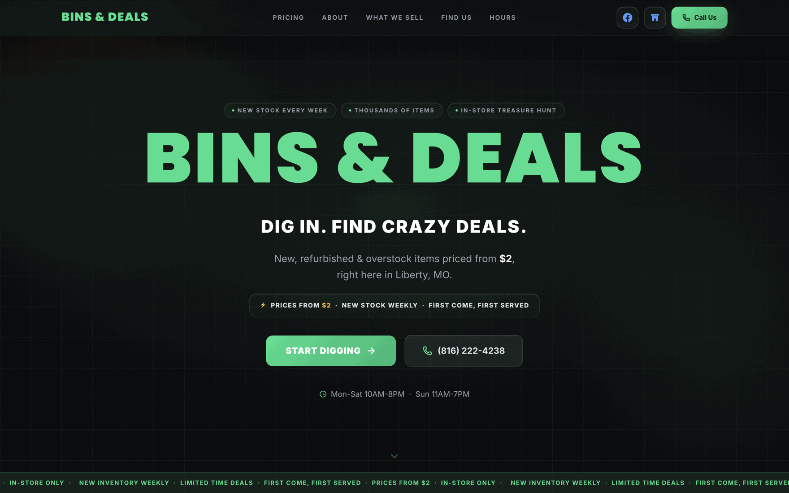
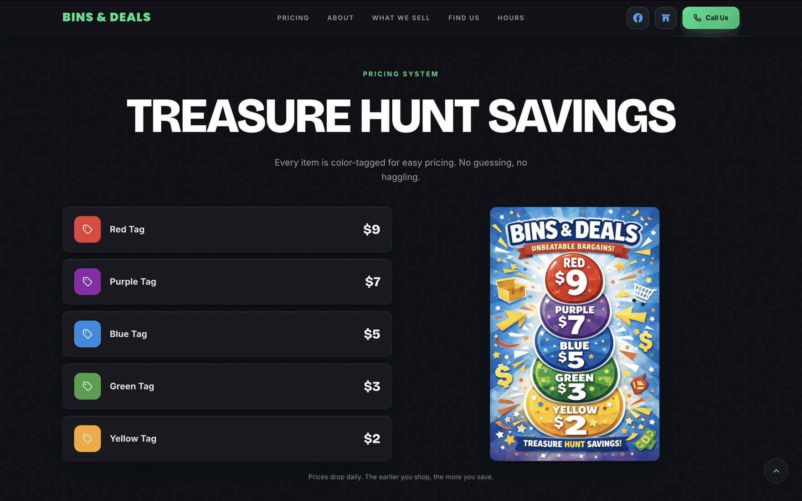
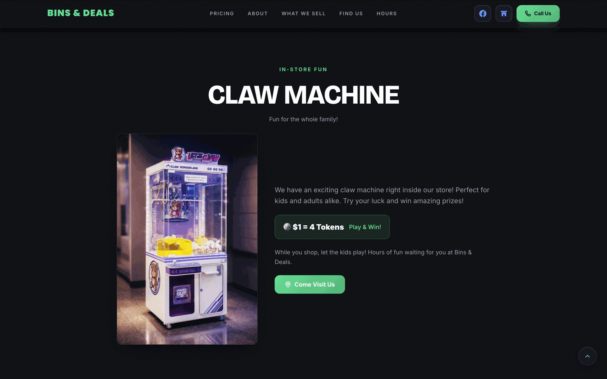
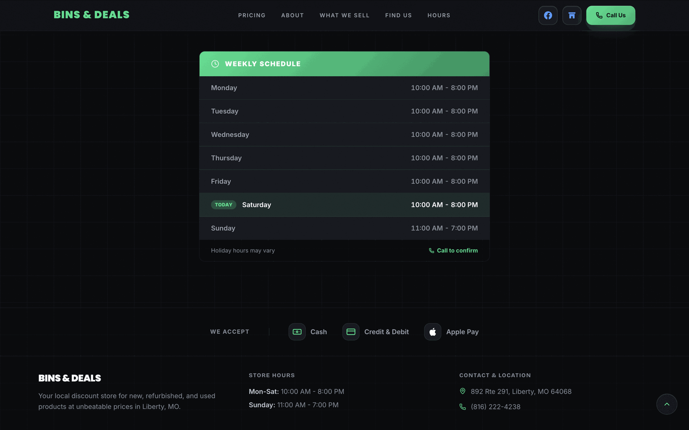
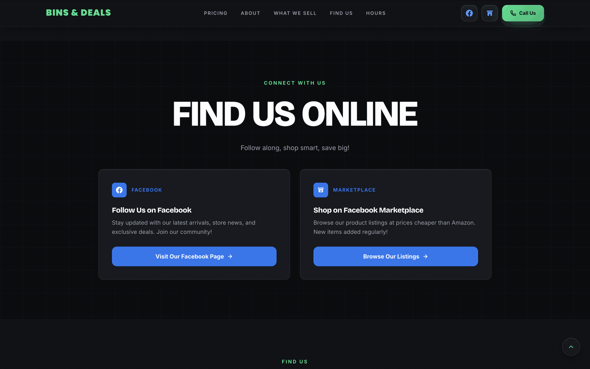

# Bins & Deals

Marketing site for Bins & Deals, a liquidation retail store in Liberty, Missouri. Single-page React app: hero, color-tag pricing explainer, product categories, in-store claw machine promo, hours and location, and links out to the store's Facebook page and Marketplace listings.

**Live:** [binsanddeals.com](https://binsanddeals.com)

## Screenshots











## Features

- Color-tag pricing table (red $9 down to yellow $2), pulled straight from the in-store system
- Weekly store hours with a "today" indicator
- Embedded location and one-tap call button
- Direct links to the store's Facebook page and Marketplace listings
- Sticky header that condenses on scroll, with a mobile menu
- Scroll-to-top button that appears past 500px of scroll
- Scroll-triggered section reveals

## Tech stack

**Frontend:** React 19, Vite 8

**Styling:** Tailwind CSS 4 (via `@tailwindcss/vite`), one custom CSS layer in `src/index.css` for base typography and scroll behavior

**Animation:** Framer Motion

**Icons:** Lucide React

There's no backend, no database, and no authentication. It's a static marketing site; the only "data" is the pricing table and store info, hardcoded in `App.jsx`.

## Project structure

```
src/
  App.jsx       # entire app: header, hero, pricing, claw machine, hours, social, footer
  main.jsx      # React root
  index.css     # Tailwind import + base layer
  assets/       # claw-machine.jpg, pricing-poster.jpg
public/
  favicon.svg
screenshots/    # screenshots used in this README
docs/           # business context, research notes, design decisions, launch outcomes
```

## Architecture

No router. It's one scrolling page, one component tree, all in `App.jsx` (about 1,200 lines). Section visibility and the sticky-header state are driven by a couple of `window.scrollY` listeners in `useEffect`, not an `IntersectionObserver`. There's no client-side state to speak of beyond UI toggles (menu open, header scrolled, back-to-top visible).

## Why I built it this way

Everything lives in one `App.jsx` instead of being split into section components. For a page this size with no reuse between sections, splitting it up would have added indirection without buying anything, so I left it flat. If the site grows past what one page can hold, that's the first thing I'd break apart.

The pricing page exists because the color-tag system is genuinely unusual and was the single biggest thing customers asked about before this site existed. It gets the most visual weight of any section for that reason.

## Accessibility

Icon-only controls (back-to-top, social links, mobile menu toggle) have `aria-label`s. Content images have descriptive `alt` text. The decorative grain overlay is marked `aria-hidden`. There's no documented contrast audit beyond that.

## Getting started

```bash
npm install
npm run dev      # starts Vite dev server
npm run build    # production build to dist/
npm run preview  # preview the production build locally
```

No environment variables required.

## Future improvements

- Split `App.jsx` into per-section components if the page keeps growing
- Move scroll-based reveals to `IntersectionObserver` instead of scroll-position polling

## License

MIT

---

Naveen Sereddy · [naveensereddy.com](https://naveensereddy.com) · [github.com/Naveen-Sereddy](https://github.com/Naveen-Sereddy)
